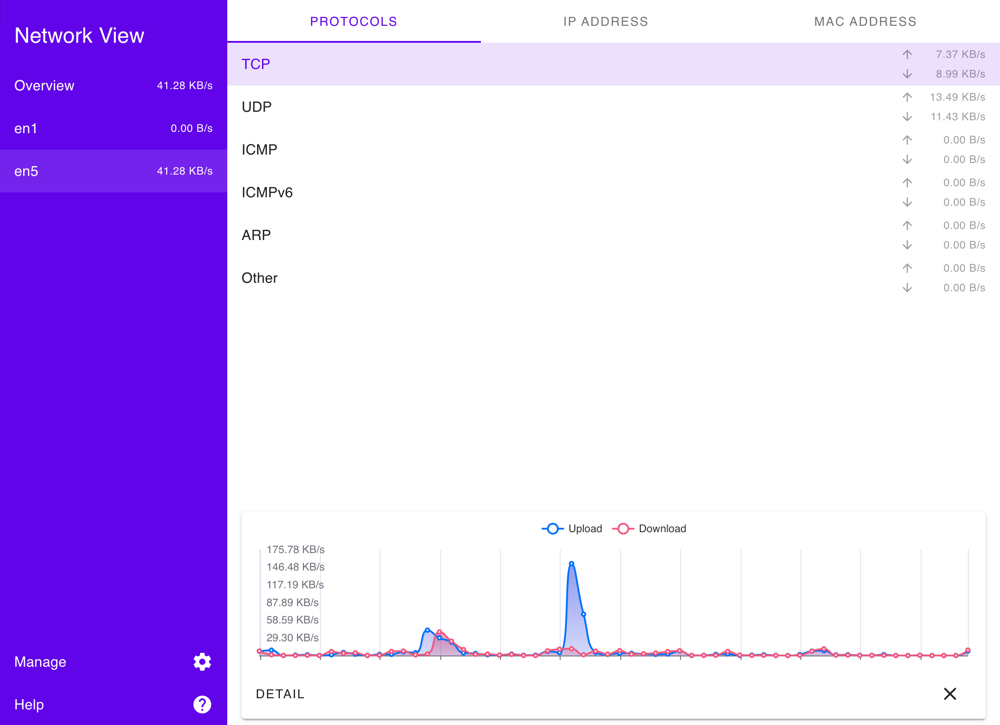

# Network View

## Purpose

Create a web server and display the real time network status of the server on browser.



## Build

Put your ssl cert and key in `src/tls` by following [this guide](src/tls/readme.md).

The build environment requirement (this app depend on [libpnet](https://github.com/libpnet/libpnet) and has the same requirement).

- Linux: `libpcap` install
- macOS: not specifies
- windows: below

```
You must use a version of Rust which uses the MSVC toolchain
You must have WinPcap or npcap installed (tested with version WinPcap 4.1.3) (If using npcap, make sure to install with the "Install Npcap in WinPcap API-compatible Mode")
You must place Packet.lib from the WinPcap Developers pack in a directory named lib, in the root of this repository. Alternatively, you can use any of the locations listed in the %LIB%/$Env:LIB environment variables. For the 64 bit toolchain it is in WpdPack/Lib/x64/Packet.lib, for the 32 bit toolchain, it is in WpdPack/Lib/Packet.lib.
```

The build tools:

- `rust`
- `nodejs (with npm)`

```console
npm run build
```

- The bin will be output to `target/release/network_view`

## Run

In latest `macOS`, it request `root` permission. And some other operation systems don't request it.

```
Q: How do I know whether root permission is requested on my operation system?

A: When you start to listen a network interface and the interface immediately go offline on the web ui.
```

And some interface will cause `program crash` when you try to listen it (This app's backend is written in `rust` and try the best not to crash, but the situation is complex between system from system, you should check the interfaces whether ok to listen or not in advance).
